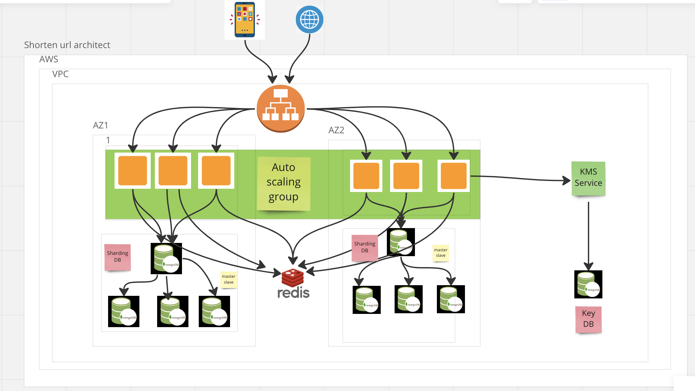

# README
## How to install
- Install ruby 2.6.5
- Install rails 6.0.1
- Install Redis
- git clone url
- cd shortener_url
- bundle install
- bundle exec rails db:migrate
- rails s

## Run rspec for endpoint
- rspec spec/controllers/v1/*

### API endpoint
#### encode
- URL: {{host}}:4000/v1/encode
- Method: POST
- Params: url: string

#### decode
- URL: {{host}}:4000/v1/decode
- Method: POST
- Params: url: string

### Potential attack vectors on the application

- Cross-site scripting (XSS) attacks: An attacker could inject malicious code into the application, which would then execute when other users click on the shortened URL. This could allow the attacker to steal user credentials or perform other malicious actions.

- SQL injection attacks: If the application uses a database to store URLs or other user data, an attacker could manipulate the input fields to inject malicious SQL code. This could allow the attacker to view or modify sensitive data, such as user credentials.

- Denial of Service (DoS) attacks: An attacker could flood the application with requests or other traffic to overwhelm the server, causing it to crash or become unavailable. This could prevent legitimate users from accessing the application or its resources.

- Phishing attacks: An attacker could create a shortened URL that appears to be legitimate, but actually redirects users to a malicious site. This could allow the attacker to steal user credentials or install malware on the user's device.

- Brute-force attacks: An attacker could use automated tools to generate and test a large number of shortened URLs in an attempt to guess valid ones. This could allow the attacker to access sensitive data or perform other malicious actions.

- To mitigate these potential attack vectors, the application could implement input validation, sanitization, and encoding to prevent injection attacks. It could also limit the number of requests per user to prevent DoS attacks, and implement multi-factor authentication to prevent phishing attacks. Regular security testing and vulnerability assessments can also help identify and address potential weaknesses in the application's security.

- Beside of we need setting for secure application as:
- 1. Set the "secure" flag on the cookie: This ensures that the cookie is only sent over HTTPS connections, which adds an extra layer of security.

- 2. Set the "HttpOnly" flag on the cookie: This prevents the cookie from being accessed by JavaScript, which helps protect against cross-site scripting (XSS) attacks.

- 3. Set the "max-age" or "expires" attribute to make the cookie read-only: This sets a specific time period for how long the cookie will be valid, after which it will expire and become read-only.
- We can use a 3rd service like Cloudflare or Aws Shield to protect application attacks

## Solution for scale up and resolve problem the duplicate or collision

### Solution for scale up
- We can use all solution include optimize source code, architect of server and optimize database as picture above.
- We use load balancing and auto scaling group for handle concurency request at same time
- We use cache and sharding database for increase speed up response of request
- The purpose of a database master-slave configuration is to achieve high availability and fault tolerance for a database system, The master server is responsible for receiving write transactions and updating the database. The slave servers receive read-only queries from clients and synchronize their data with the master server using a process called replication, Overall, the master-slave configuration is a common and effective way to ensure high availability, scalability, and fault tolerance for database systems.

### Resolve problem the duplicate or collision
- For resolve this problem we have many solution but i think we can use Key Generation Service (KGS) is better.
- Generating a unique key at scale without duplication and collisions can be a bit of a challenge. To solve this problem, we can create a standalone Key Generation Service (KGS) that generates a unique key ahead of time and stores it in a separate database for later use. This approach can make things simple for us.
#### Step by step
##### Encode
- When a user creates a new URL, our API server requests a new unique key from the Key Generation Service (KGS).
- Key Generation Service provides a unique key to the API server and marks the key as used.
- API server writes the new URL entry to the database and cache.
- Our service returns an HTTP 200 response to the user.

##### Accessing a URL
- When a client navigates to a certain short URL, the request is sent to the API servers.
- The request first hits the cache, and if the entry is not found there then it is retrieved from the database and an HTTP 301 (Redirect) is issued to the original URL.
- If the key is still not found in the database, an HTTP 404 (Not found) error is sent to the user.